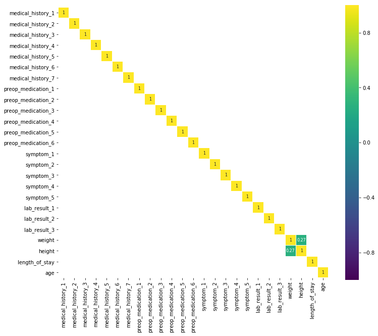
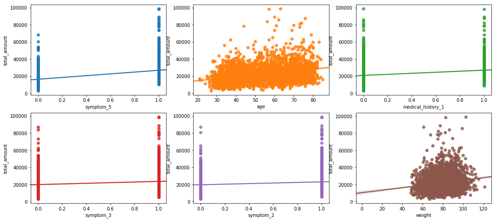
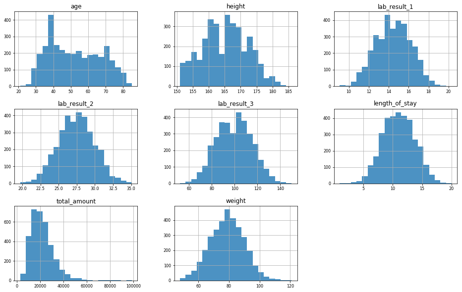
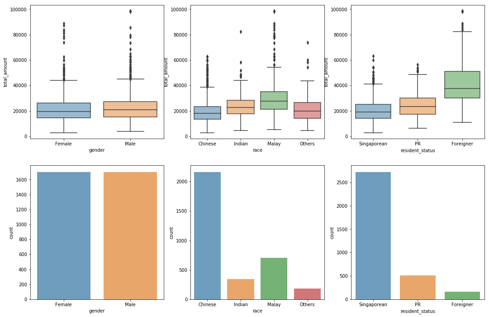
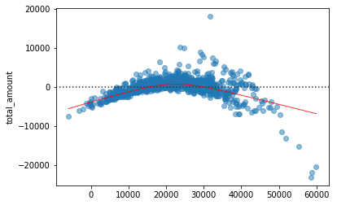
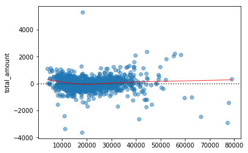
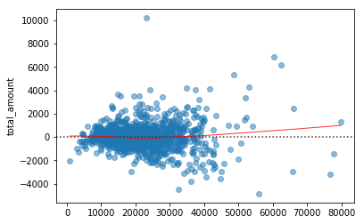

# Analysis on Clinical and Financial Data of Patients with a Certain Condition

#### Matthew Zakharia Hadimaja

In this analysis, we analysed clinical and financial data of patients with a certain condition. The goal is to predict the cost charged to a patient using the patient's clinical data. Before the analysis, we cleaned the data to make our analysis easier and joined the four tables (`bill_amount`, `bill_id`, `clinical_data`, and `demographics`) into one dataframe `df`.

    <class 'pandas.core.frame.DataFrame'>
    MultiIndex: 3400 entries, (00225710a878eff524a1d13be817e8e2, 2014-04-10 00:00:00) to (ffd9644f8daf1d28493a7cd700bb30f4, 2013-06-04 00:00:00)
    Data columns (total 31 columns):
    total_amount          3400 non-null float64
    date_of_discharge     3400 non-null datetime64[ns]
    medical_history_1     3400 non-null int64
    medical_history_2     3167 non-null float64
    medical_history_3     3400 non-null int64
    medical_history_4     3400 non-null int64
    medical_history_5     3096 non-null float64
    medical_history_6     3400 non-null int64
    medical_history_7     3400 non-null int64
    preop_medication_1    3400 non-null int64
    preop_medication_2    3400 non-null int64
    preop_medication_3    3400 non-null int64
    preop_medication_4    3400 non-null int64
    preop_medication_5    3400 non-null int64
    preop_medication_6    3400 non-null int64
    symptom_1             3400 non-null int64
    symptom_2             3400 non-null int64
    symptom_3             3400 non-null int64
    symptom_4             3400 non-null int64
    symptom_5             3400 non-null int64
    lab_result_1          3400 non-null float64
    lab_result_2          3400 non-null float64
    lab_result_3          3400 non-null float64
    weight                3400 non-null float64
    height                3400 non-null float64
    gender                3400 non-null object
    race                  3400 non-null object
    resident_status       3400 non-null object
    date_of_birth         3400 non-null datetime64[ns]
    length_of_stay        3400 non-null int64
    age                   3400 non-null int64
    dtypes: datetime64[ns](2), float64(8), int64(18), object(3)
    memory usage: 871.7+ KB
    

## Exploratory Data Analysis

The predictors in our data consist mostly of two types: numerical and categorical variales. As can be seen from the plot below, the numerical variables are uncorrelated of each other.

Besides looking at the linear relationship between predictors, we also take a look at the linear relationship between `total_amount` and the predictors. According to the our result, the variables `symptom_5`, `age`, and `medical_history_1` correlate with `total_amount` the most. Later on, we will see that these variables are prominent in the prediction models. Below is the `total_amount` plotted against the top 6 correlated variables.

We can further separate the numerical variables in our data into two: continuous variables and binary variables. Below are the histograms of the continuous variables. It seems that the continuous variables are distributed well.

As for the binary variables, below are the bar plots of them. Although the medical histories are not distributed equally (as expected), they are still acceptable. We did check their variance and found no variables with near zero variance.

For the categorical variables, we use box plots and bar plots to visualize the distribution of `total_amount` across the categories. We see no discrepancies across gender, but there are some noticable differences across different races and residential status. Of course, both `race` and `resident_status` are not distributed equally.

To end our exploratory data analysis, we also checked the average values of the binary variables across different categorical variables. Just skimming through the table, it seems there are only a few variables that differ across certain categories. For example, the percentage of patient with `medical_history_3` is higher in PR and Singaporean than that in Foreigner.

<table border="1" class="dataframe">
  <thead>
    <tr>
      <th></th>
      <th colspan="2" halign="left">Gender</th>
      <th colspan="4" halign="left">Race</th>
      <th colspan="3" halign="left">Resident Status</th>
    </tr>
    <tr>
      <th></th>
      <th>Female</th>
      <th>Male</th>
      <th>Chinese</th>
      <th>Indian</th>
      <th>Malay</th>
      <th>Others</th>
      <th>Foreigner</th>
      <th>PR</th>
      <th>Singaporean</th>
    </tr>
  </thead>
  <tbody>
    <tr>
      <th>medical_history_1</th>
      <td>0.175088</td>
      <td>0.163133</td>
      <td>0.167590</td>
      <td>0.156977</td>
      <td>0.172560</td>
      <td>0.196721</td>
      <td>0.180124</td>
      <td>0.159223</td>
      <td>0.170338</td>
    </tr>
    <tr>
      <th>medical_history_2</th>
      <td>0.316256</td>
      <td>0.306431</td>
      <td>0.304391</td>
      <td>0.336449</td>
      <td>0.316514</td>
      <td>0.327273</td>
      <td>0.315789</td>
      <td>0.290795</td>
      <td>0.314939</td>
    </tr>
    <tr>
      <th>medical_history_3</th>
      <td>0.133960</td>
      <td>0.138398</td>
      <td>0.131117</td>
      <td>0.139535</td>
      <td>0.155587</td>
      <td>0.114754</td>
      <td>0.074534</td>
      <td>0.139806</td>
      <td>0.139134</td>
    </tr>
    <tr>
      <th>medical_history_4</th>
      <td>0.056404</td>
      <td>0.047703</td>
      <td>0.053093</td>
      <td>0.066860</td>
      <td>0.048091</td>
      <td>0.027322</td>
      <td>0.037267</td>
      <td>0.046602</td>
      <td>0.053965</td>
    </tr>
    <tr>
      <th>medical_history_5</th>
      <td>0.071705</td>
      <td>0.056202</td>
      <td>0.066531</td>
      <td>0.053797</td>
      <td>0.066770</td>
      <td>0.041916</td>
      <td>0.075342</td>
      <td>0.078224</td>
      <td>0.060557</td>
    </tr>
    <tr>
      <th>medical_history_6</th>
      <td>0.235605</td>
      <td>0.273852</td>
      <td>0.256233</td>
      <td>0.258721</td>
      <td>0.253182</td>
      <td>0.234973</td>
      <td>0.229814</td>
      <td>0.279612</td>
      <td>0.251468</td>
    </tr>
    <tr>
      <th>medical_history_7</th>
      <td>0.271445</td>
      <td>0.237338</td>
      <td>0.258079</td>
      <td>0.267442</td>
      <td>0.234795</td>
      <td>0.262295</td>
      <td>0.298137</td>
      <td>0.285437</td>
      <td>0.245962</td>
    </tr>
    <tr>
      <th>preop_medication_1</th>
      <td>0.507638</td>
      <td>0.500000</td>
      <td>0.508772</td>
      <td>0.508721</td>
      <td>0.486563</td>
      <td>0.502732</td>
      <td>0.447205</td>
      <td>0.493204</td>
      <td>0.509178</td>
    </tr>
    <tr>
      <th>preop_medication_2</th>
      <td>0.595770</td>
      <td>0.586572</td>
      <td>0.578486</td>
      <td>0.630814</td>
      <td>0.605375</td>
      <td>0.612022</td>
      <td>0.534161</td>
      <td>0.578641</td>
      <td>0.596916</td>
    </tr>
    <tr>
      <th>preop_medication_3</th>
      <td>0.815511</td>
      <td>0.826266</td>
      <td>0.822715</td>
      <td>0.840116</td>
      <td>0.817539</td>
      <td>0.775956</td>
      <td>0.869565</td>
      <td>0.800000</td>
      <td>0.821953</td>
    </tr>
    <tr>
      <th>preop_medication_4</th>
      <td>0.541716</td>
      <td>0.504711</td>
      <td>0.516159</td>
      <td>0.529070</td>
      <td>0.548798</td>
      <td>0.497268</td>
      <td>0.534161</td>
      <td>0.549515</td>
      <td>0.517621</td>
    </tr>
    <tr>
      <th>preop_medication_5</th>
      <td>0.830787</td>
      <td>0.808598</td>
      <td>0.823638</td>
      <td>0.811047</td>
      <td>0.814710</td>
      <td>0.808743</td>
      <td>0.795031</td>
      <td>0.834951</td>
      <td>0.818282</td>
    </tr>
    <tr>
      <th>preop_medication_6</th>
      <td>0.739718</td>
      <td>0.748528</td>
      <td>0.741921</td>
      <td>0.741279</td>
      <td>0.752475</td>
      <td>0.743169</td>
      <td>0.788820</td>
      <td>0.724272</td>
      <td>0.745228</td>
    </tr>
    <tr>
      <th>symptom_1</th>
      <td>0.615746</td>
      <td>0.623675</td>
      <td>0.620499</td>
      <td>0.598837</td>
      <td>0.616690</td>
      <td>0.661202</td>
      <td>0.577640</td>
      <td>0.609709</td>
      <td>0.624082</td>
    </tr>
    <tr>
      <th>symptom_2</th>
      <td>0.670388</td>
      <td>0.654299</td>
      <td>0.656510</td>
      <td>0.697674</td>
      <td>0.660537</td>
      <td>0.672131</td>
      <td>0.695652</td>
      <td>0.664078</td>
      <td>0.660059</td>
    </tr>
    <tr>
      <th>symptom_3</th>
      <td>0.528790</td>
      <td>0.560660</td>
      <td>0.544321</td>
      <td>0.584302</td>
      <td>0.541726</td>
      <td>0.486339</td>
      <td>0.490683</td>
      <td>0.557282</td>
      <td>0.545521</td>
    </tr>
    <tr>
      <th>symptom_4</th>
      <td>0.716804</td>
      <td>0.736160</td>
      <td>0.725762</td>
      <td>0.706395</td>
      <td>0.735502</td>
      <td>0.737705</td>
      <td>0.708075</td>
      <td>0.718447</td>
      <td>0.729075</td>
    </tr>
    <tr>
      <th>symptom_5</th>
      <td>0.519976</td>
      <td>0.533569</td>
      <td>0.520776</td>
      <td>0.587209</td>
      <td>0.519095</td>
      <td>0.513661</td>
      <td>0.546584</td>
      <td>0.526214</td>
      <td>0.525698</td>
    </tr>
  </tbody>
</table>

## Machine Learning

We tried several methods to predict `total_amount`: linear regression, polynomial regression, LASSO, regression tree, support vector regression, and neural network. From our findings, polynomial regression performed the best, with neural network to follow it. Regression tree performed badly, and there wasn't much penalty imposed on the optimal LASSO model. Below are the test errors in MSE.

    Linear regression     2473.793
    Polynomial regression  520.633
    LASSO                 2466.897
    Regression Tree       4868.979
    SVR                   2555.064
    Neural Network        1122.375

To illustrate the results, here are some residual plots of some methods: linear regression as the baseline method, with polynomial regression and neural network as the best performing methods.

#### Linear Regression

#### Polynomial Regression

#### Neural Network

From our analysis on the OLS coefficients, we can see that the variables that are highly correlated with `total_amount` dominate the coeffients.

## Conclusion

From our analysis, we see that the symptom variables and the demographic variables (for example, race and resident status) affect the cost more. On the other hand, a majority of the medical history variables, all pre-op medications, and all lab results variables don't seem to contribute much in determining the cost. These patterns can be seen in both our exploratory data analysis part and the statistical modeling part.

We also found that simple model with heavily regularised parameters are not suitable for our data. In our analysis, complicated methods with many parameters such as polynomial regression and neural network perform the best, while simple methods don't.

To close our analysis, we hope that this analysis may be of value to parties from various background, be it someone who wants to estimate his/her expected hospitalisation cost, an insurance company who wants to compute premiums for their prospective clients, or a digital health company, focused on solving complex problems in healthcare.
